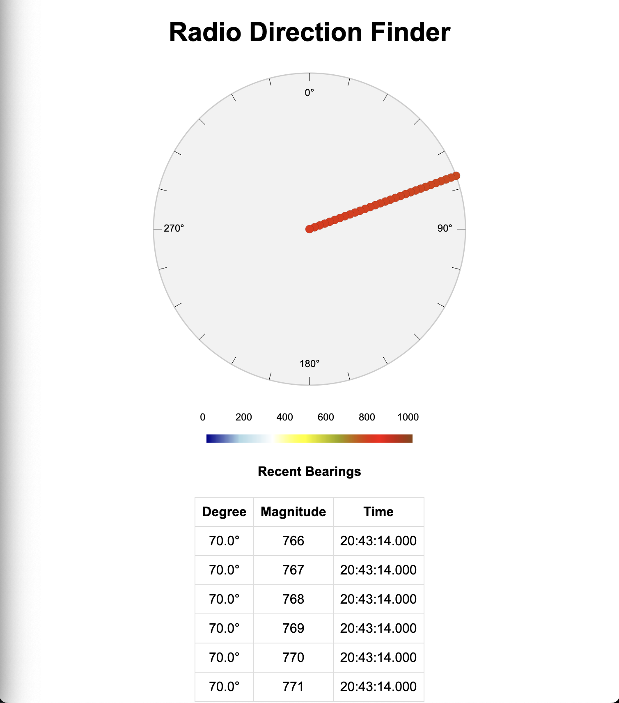
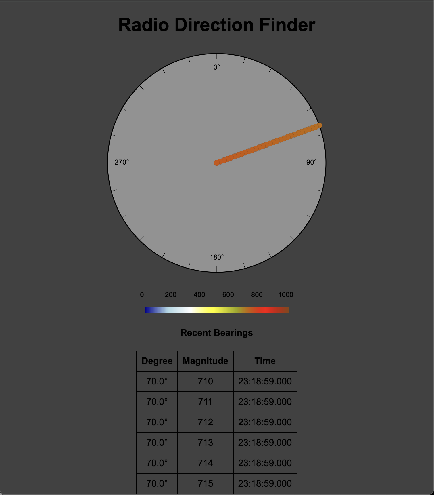

# compass

This application reads bearings and plots them on a compass

In its current implementation, it reads 23 (or 25 if padding is used) character lines from STDIN and plots bearing circles on a compass.

## Building

```bash
go build
```

Alternatively, you can set the **OS** and **ARCH** when compiling the code. 
- Build for Raspberry PI (ARM) Running 32 bit Linux

  ```bash
  GOOS=linux GOARCH=arm go build
  ```

- Build for RaspBerry PI (ARM) running 64 bit Linux

  ```bash
  GOOS=linux GOARCH=arm64 go build
  ```

## Usage

```bash
% ./compass --help
Usage of ./compass:
  -accessible
    	Enable accessible color mode
  -bearings int
    	Max bearings to cache (default 20)
  -colors string
    	5 colors to use for displaying magnitude, low to high (default "#2c7bb6,#abd9e9,#ffffbf,#fdae61,#d7191c")
  -darkmode
    	Enable dark mode
  -expire int
    	Bearing expire interval in milliseconds (default 2000)
  -paddedTimestamp
    	Pad timestamps to 15 digits
  -refresh int
    	Refresh interval in milliseconds (default 200)
  -rows int
    	Max table rows to display (default 5)
```

## Generating fake input data

13 digit millisecond unix timestamps:

`for i in $(seq -f "%03g" 0 359) ; do echo -n "C$i" ; echo -n "0000000" ; printf "%010d" "$(($(date +%s)))" ; echo "000" ; sleep 0.5 ; done  >> bearings`

15 digit millisecond unix timestamps:

`for i in $(seq -f "%03g" 0 359) ; do echo -n "C$i" ; echo -n "0000000" ; printf "%012d" "$(($(date +%s)))" ; echo "000" ; sleep 0.5 ; done  >> bearings`

## Example run

```bash
tail -F bearings | ./compass -bearings=30 -refresh=100 -expire=1500
```

## Gradient versus accessibility colors

By default, the bearings are displayed in gradients of color (based on the magnitude):
* Dark Blue (min)
* Light Blue
* White
* Yellow
* Orange
* Red
* Brown (max)

For accessbility reasons, you can run the server with `-accessible` and it will only display 5 colors, changing at every magnitude increase by 200:
* #2c7bb6
* #abd9e9
* #ffffbf
* #fdae61
* #d7191c

You can override the default colors from command line, appending `-colors` with the value being five comma sepparated colors expressed as hex values with leading hashtag (Eg: `-colors="#2c7bb6,#abd9e9,#ffffbf,#fdae61,#d7191c"`)

## Sample UI

### Fake data input with 70.0° and ~770 magnitude.



### Dark Mode



## Complete list of OS and ARCH

With GO version 1.21.0, the following OS and ARCH combinations are allowed as seen in `go tool dist list`:

| OS \ ARCH | 386 | amd64 | arm | arm64 | loong64 | mips | mips64 | mips64le | mipsle | ppc64 | ppc64le | riscv64 | s390x | WASM |
| --------- | --- | ----- | --- | ----- | ------- | ---- | ------ | -------- | ------ | ----- | ------- | ------- | ----- | ---- |
| aix       |     |       |     |       |         |      |        |          |        | X     |         |         |       |      |
| android   | X   | X     | X   | X     |         |      |        |          |        |       |         |         |       |      |
| darwin    |     | X     |     | X     |         |      |        |          |        |       |         |         |       |      |
| dragonfly |     | X     |     |       |         |      |        |          |        |       |         |         |       |      |
| freebsd   | X   | X     | X   | X     |         |      |        |          |        |       |         | X       |       |      |
| illumos   |     | X     |     |       |         |      |        |          |        |       |         |         |       |      |
| ios       |     | X     |     | X     |         |      |        |          |        |       |         |         |       |      |
| js        |     |       |     |       |         |      |        |          |        |       |         |         |       | X    |
| linux     | X   | X     | X   | X     | X       | X    | X      | X        | X      | X     | X       | X       | X     |      |
| netbsd    | X   | X     | X   | X     |         |      |        |          |        |       |         |         |       |      |
| openbsd   | X   | X     | X   | X     |         |      |        |          |        |       |         |         |       |      |
| plan9     | X   | X     | X   |       |         |      |        |          |        |       |         |         |       |      |
| solaris   |     | X     |     |       |         |      |        |          |        |       |         |         |       |      |
| wasip1    |     |       |     |       |         |      |        |          |        |       |         |         |       | X    |
| windows   | X   | X     | X   | X     |         |      |        |          |        |       |         |         |       |      |
